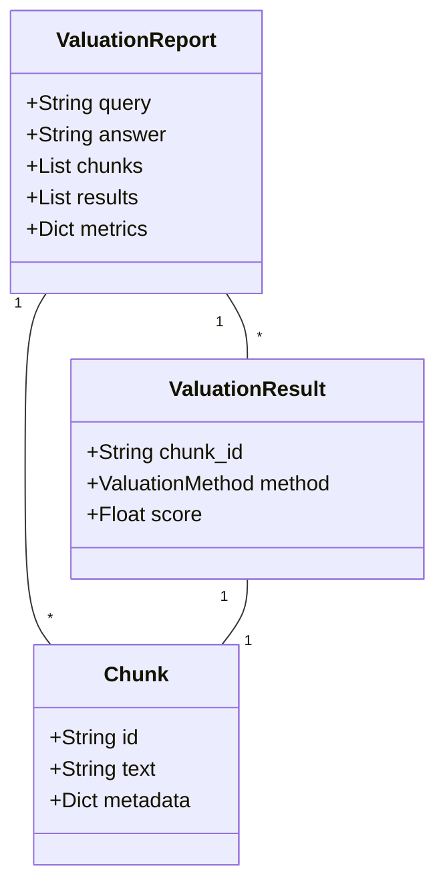

# Data Model: RAG Data Valuation

## Entities

### Chunk
Represents a segment of text retrieved from the knowledge base.
- `id` (str): Unique identifier (hash of content).
- `text` (str): The actual content of the chunk.
- `metadata` (dict): Optional metadata (source, page, etc.).

### ValuationMethod
Enum for different valuation algorithms.
- `LOO`
- `SHAPLEY`
- `ATTENTION`

### ValuationResult
The calculated value for a specific chunk using a specific method.
- `chunk_id` (str): Reference to the Chunk.
- `method` (ValuationMethod): Method used.
- `score` (float): The calculated value.

### ValuationReport
A comprehensive report for a single query evaluation.
- `query` (str): The user input.
- `answer` (str): The generated answer.
- `chunks` (List[Chunk]): The retrieved chunks.
- `results` (List[ValuationResult]): Valuation scores for all chunks.
- `metrics` (dict): Global metrics (e.g., Overall Faithfulness via Ragas).

## Ragas Integration Schema
For evaluation, data must be mapped to the Ragas dataset format:
- `question` (str) -> `ValuationReport.query`
- `answer` (str) -> `ValuationReport.answer`
- `contexts` (List[str]) -> list of `Chunk.text` for the subset being evaluated.

## Relationships

